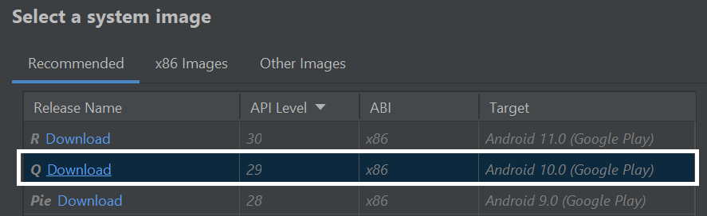

# Interacción con la aplicación

## ¿Cómo iniciar la app?

### Paso 1: Descargar el código fuente con git

```bash
git clone <repo url>
```

### Paso 2: Instalar las dependencias

```bash
yarn install
```

### Paso 3: Abrir emulador de Android Studio
Se puede ver la lista de dispositivos virtuales de Android disponibles abriendo el administrador de AVD (AVD Manager) desde Android Studio. Buscar un icono que tenga este aspecto:


Si instaló Android Studio recientemente, es probable que deba crear un nuevo AVD. Seleccione "Create Virtual Device..." para crear un dispositivo virtual, luego elija cualquier teléfono de la lista y haga clic en "Next", luego seleccione la imagen "Q API Level 29 image"



### Paso 4: Iniciar Metro Bundler

Iniciar una terminal desde vsCode y ejecutar:
```bash
yarn start
```

### Paso 5: Levantar App en Android:

Iniciar una segunda terminal en vsCode y ejecutar:
```bash
yarn android
```

Ésto levantará nuestra aplicación en el emulador para poder interactuar con ella.